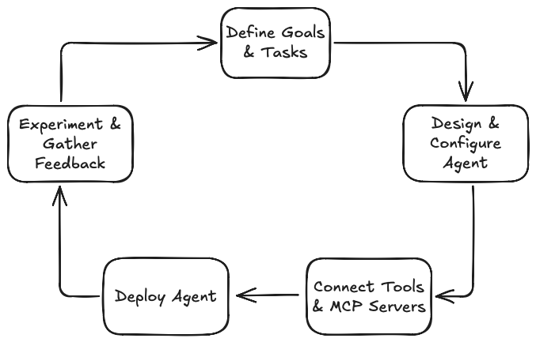
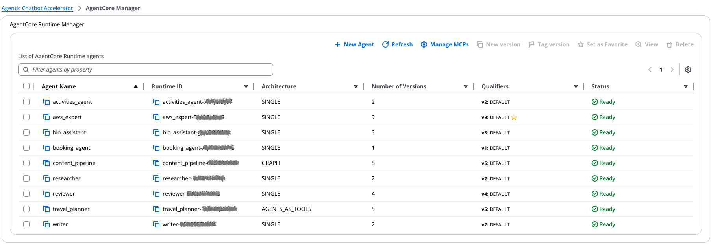
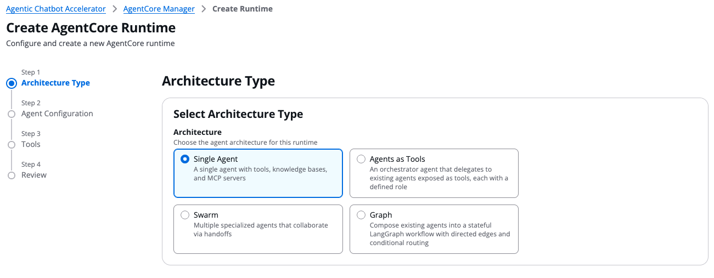
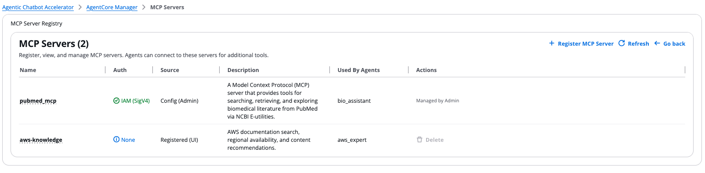
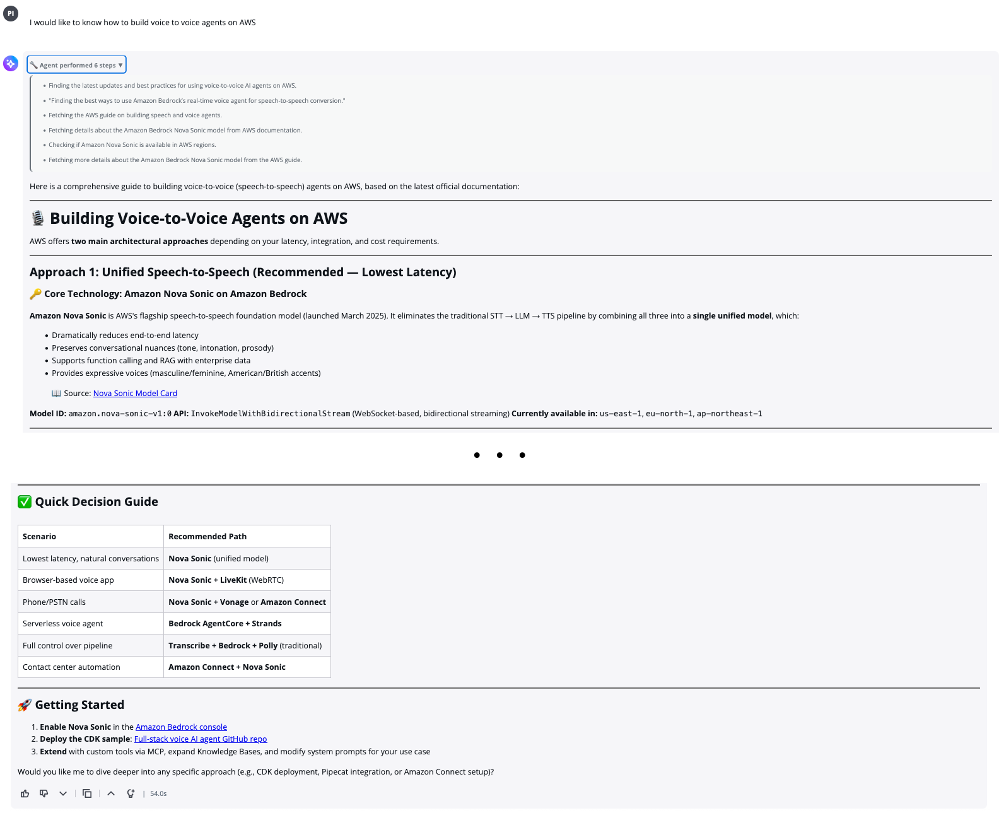

# Agentic Chatbot Accelerator

The Agentic Chatbot Accelerator is a full-stack solution for building, deploying, and iterating on agentic chatbots. It implements an iterative agent development lifecycle:

  

1. **Define Goals & Tasks** – What your agent should accomplish and the tasks it needs to perform
2. **Design & Configure Agent** – Foundation model selection, agentic pattern choice, and agent system prompts
3. **Connect Tools & MCP Servers** – Tools and MCP (Model Context Protocol) servers that extend agent capabilities with external resources
4. **Deploy Agent** – Managed runtime environment for your agents
5. **Experiment & Gather Feedback** – Agent behavior testing, human feedback collection, and iterative refinement

The accelerator provides a web-based interface, agent factory, knowledge base management, and observability tooling to support this full cycle. The current implementation deploys on AWS using CDK or Terraform, leveraging Amazon Bedrock AgentCore.

## How to Get Started

The following steps use **CDK** (the default deployment method). For Terraform, see [Terraform Deployment](./iac-terraform/README.md).

1. **Install required packages**: Run `cd iac-cdk && npm install`
2. **Configure features** *(optional)*: Create `iac-cdk/bin/config.yaml` to customize deployment (see [How to Deploy](./docs/src/how-to-deploy.md))
3. **Deploy Infrastructure**: Run `make deploy` to deploy the CDK stacks (no local Docker/Finch required — builds run on AWS CodeBuild)
4. **Create User**: Add a user to the Cognito User Pool (<environment-prefix>-aca-userPool) via AWS Console
5. **Access Application**: Open the web application using the URL from CDK deployment outputs
6. **Configure Agent**: Use the Agent Factory to create and configure your first AgentCore runtime
7. **Test & Chat**: Interact with your agent through the chatbot interface
8. **Iterate**: Refine agent settings, add tools, and redeploy as needed

## See It in Action

The Agent Manager lets you configure and deploy agents through the full lifecycle — select models, craft instructions, attach tools and MCP servers, deploy, and iterate:

Choose between single agent or multi-agent patterns to match your use case:

Use the [Agent Factory](./docs/src/agent-factory.md) to create agents with any of these patterns:

- [Single Agent](./docs/src/agentic-patterns/single-agent.md) – One agent with direct access to tools, knowledge bases, and MCP servers
- [Agents as Tools](./docs/src/agentic-patterns/agents-as-tools.md) – Orchestrate specialized sub-agents as callable tools
- [Swarm](./docs/src/agentic-patterns/swarm-agents.md) – Coordinate a swarm of collaborative agents
- [Graph](./docs/src/agentic-patterns/graph-agents.md) – Define agent workflows as directed graphs

Register and manage MCP servers to extend your agents with external capabilities. The MCP Server Registry lets you connect agents to tools like AWS documentation search, biomedical literature APIs, and custom services. See [Expanding AI Tools](./docs/src/expanding-ai-tools.md) for details on adding MCP servers and custom tools.

Test your agents through the built-in chatbot interface — interact in real-time, review responses, and provide feedback. Users get real-time visibility as the agent makes calls to tools, and can provide feedback on each response via thumbs up/down or free-text comments.

For systematic validation, run evaluations powered by the [Strands Agents Evals SDK](https://strandsagents.com/latest/documentation/docs/user-guide/evals-sdk/quickstart/) to assess output quality, tool usage, trajectory efficiency, and multi-agent interactions. See [Agent Evaluation](./docs/src/evaluation.md) for details.

## AWS Platform Details

- [Architecture](./docs/src/architecture.md)
- [API Reference](./docs/src/api.md)
- [Agent Event Architecture](./docs/src/token-streaming-architecture.md)
- [Observability & Insights](./docs/src/observability-insights.md)

## Optional Features

The accelerator supports flexible deployment configurations:

- **Knowledge Base & Document Processing** — RAG capabilities with document upload, chunking, and retrieval. Disable by omitting `knowledgeBaseParameters` and `dataProcessingParameters`. See [Knowledge Base Management](./docs/src/kb-management.md).

- **Pre-configured Agent Runtime** — Automatically deploy an agent runtime via CDK instead of creating one manually through the Agent Factory UI. Enable by adding `agentRuntimeConfig` to your configuration.

- **Observability** — X-Ray distributed tracing for agent invocations. Enable by adding `agentCoreObservability` to your configuration. See [Observability & Insights](./docs/src/observability-insights.md).

- **Experiments Generator** — Synthetic test case generation using AWS Batch. Requires a VPC; you can provide an existing one via `vpcId` or disable the feature entirely with `deployBatchInfrastructure: false` if VPC permissions are unavailable. See [Experiments Configuration](./docs/src/how-to-deploy.md#experiments-configuration-vpc--batch).

See [How to Deploy](./docs/src/how-to-deploy.md#deployment-scenarios) for full configuration details.

## How to Contribute

See [CONTRIBUTING.md](./CONTRIBUTING.md) for detailed contribution guidelines.

- **Bug Reports & Feature Requests**: Create issues in GitHub for bugs or new feature proposals
- **Security Scan**: Run ASH (Automated Security Helper) scan before opening a pull request for review
- **Major Changes**: Propose a design document before implementing significant features or architectural changes

## Security

Note: this asset represents a proof-of-value for the services included and is not intended as a production-ready solution. You must determine how the AWS Shared Responsibility applies to their specific use case and implement the needed controls to achieve their desired security outcomes. AWS offers a broad set of security tools and configurations to enable our customers.

Ultimately it is your responsibility as the developer of a full stack application to ensure all of its aspects are secure. We provide security best practices in repository documentation and provide a secure baseline but Amazon holds no responsibility for the security of applications built from this tool.

## License

This project is licensed under the MIT-0 License. See the LICENSE file.
