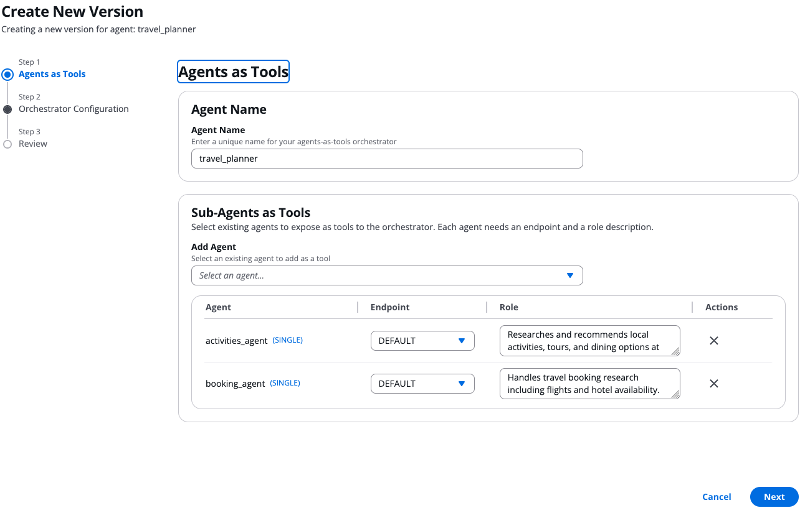
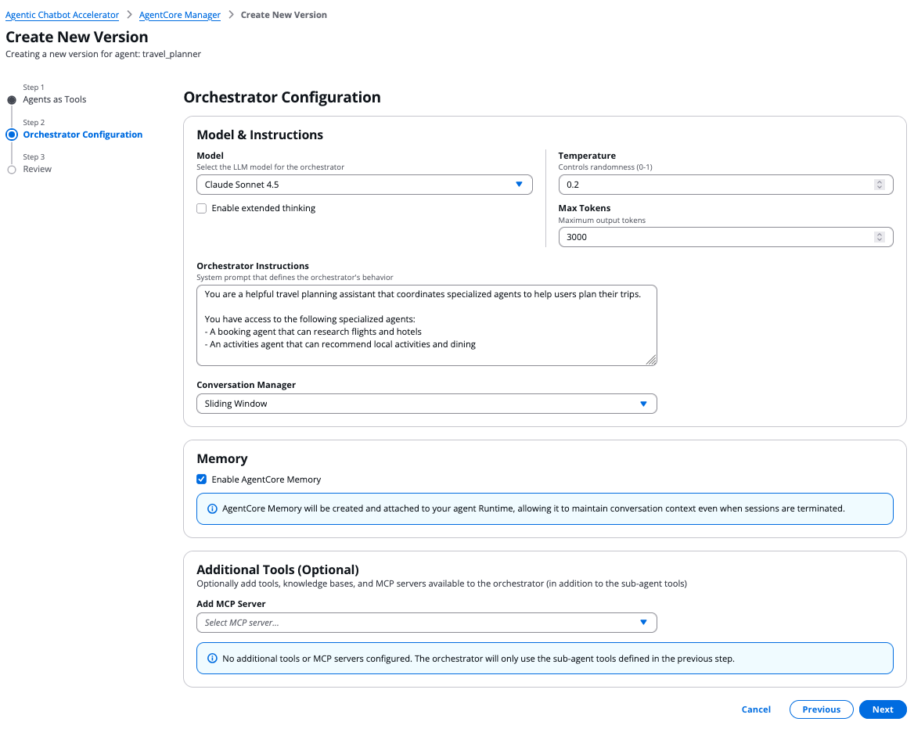

# Agents as Tools

This guide explains how to create and test agents using the **agents-as-tools** pattern with the Agentic Chatbot Accelerator. In this pattern, an orchestrator agent delegates tasks to specialized sub-agents that are exposed as callable tools.

## Overview

An agents-as-tools configuration consists of:

- **Orchestrator Agent**: A central agent with its own model, instructions, and reasoning capabilities that decides which sub-agents to invoke
- **Sub-Agents as Tools**: Existing deployed agents wired in as tools. Each sub-agent's **Description** (set on the sub-agent itself when you create it) is published on its A2A agent card, and the orchestrator reads that description to decide when to delegate. There is no separate "role" field on the orchestrator — the sub-agent owns its own capability blurb.
- **Endpoint**: The qualifier/endpoint of each sub-agent (e.g. `DEFAULT`)
- **Optional Tools**: Additional tools, knowledge bases, and MCP servers available to the orchestrator alongside the sub-agent tools

Under the hood the orchestrator talks to each sub-agent over the [A2A protocol](https://a2a-protocol.org/) — it discovers each sub-agent's agent card, builds a tool out of it (using the card's `description`), and the LLM picks among those tools. So a sub-agent's `Description` is the single source of truth for delegation. If two sub-agents have overlapping descriptions, the orchestrator can't disambiguate; if a description is empty, the agent card publishes a generic fallback and delegation becomes unreliable.

Unlike graph agents where the execution flow is predefined by edges, the orchestrator dynamically decides which sub-agent(s) to invoke based on the user's request and each sub-agent's description. The orchestrator can invoke multiple sub-agents in sequence, combine their outputs, and reason about the results before responding to the user.

This pattern is inspired by the [Strands Agents multi-agent agents-as-tools](https://strandsagents.com/docs/user-guide/concepts/multi-agent/agents-as-tools/) approach.

## Prerequisites

Before creating an agents-as-tools orchestrator, you need:

1. **At least one deployed agent** (single, swarm, or graph) with status "Ready" and a tagged endpoint (e.g. DEFAULT)
2. **The accelerator deployed** with the agents-as-tools feature enabled (CDK stack includes the agents-as-tools container image)

## Step-by-Step: Creating an Agents-as-Tools Orchestrator

### 1. Create the sub-agents first

Each sub-agent is an independent agent that can be invoked on its own. Create them through the UI:

1. Go to **Agent Factory** → **Create Agent**
2. Select **Single Agent** architecture
3. Configure the agent with its own name, instructions, and model
4. **Fill in the Agent Description** — this is the capability blurb the orchestrator's LLM will read to decide when to delegate. Write it in present tense and lead with what the agent *does*, not what it *is*. See [Single Agent → Add an agent description](single-agent.md) for the full guidance.
5. Wait for it to reach "Ready" status and ensure it has a tagged endpoint (e.g. DEFAULT)

> **Why the description matters here:** when an agent is wired as a sub-agent, its A2A twin runtime publishes an agent card with this description. If you skip the description on the sub-agent, the orchestrator's LLM has no reliable signal for picking it over other sub-agents.

### 2. Create the orchestrator agent

1. Go to **Agent Factory** → **Create Agent**
2. In the **Architecture Type** step, select **Agents as Tools**
3. Enter a name for the orchestrator agent (e.g. `travel_planner`)

### 3. Add sub-agents as tools

In the **Agents as Tools** step:

1. Use the **Select an agent** dropdown to add existing agents as tools
2. For each agent, select the **Endpoint** from the dropdown (typically "DEFAULT")
3. You can add multiple sub-agents; the orchestrator will reason about which one(s) to call

There is **no role field on this step** — the orchestrator reads each sub-agent's own Description (the one you set when creating the sub-agent) from its A2A agent card. To change how the orchestrator perceives a sub-agent, edit that sub-agent's Description (create a new version of the sub-agent), don't try to override it here.



### 4. Configure the orchestrator

In the **Orchestrator Configuration** step:

1. **Model**: Select the LLM model for the orchestrator (e.g. Claude Haiku 4.5)
2. **Instructions**: Write a system prompt that tells the orchestrator how to use its sub-agents. Reference the sub-agents by their roles and explain the delegation strategy.
3. **Conversation Manager**: Choose how conversation history is managed (Sliding Window is recommended)
4. **Additional Tools** (optional): Add extra tools, knowledge bases, or MCP servers that the orchestrator can use directly alongside its sub-agent tools



### 5. Review and create

The review step shows:

- A **Sub-Agent Tools** summary table (agent name, endpoint, and description sourced from each sub-agent's A2A card)
- A **JSON preview** of the complete configuration

Click **Create Runtime** to submit. The orchestrator agent goes through the same creation pipeline as other agents (Step Function → AgentCore Runtime).

### 6. Test the orchestrator

Once the orchestrator reaches "Ready" status:

1. Go to the **Chat** interface
2. Select your orchestrator agent's endpoint
3. Send a message — the orchestrator will analyze the request, decide which sub-agent(s) to invoke, and synthesize a response

## Example: Travel Planning Agent

A travel planning orchestrator that delegates to specialized sub-agents for booking and activities.

### Step 1 — Create two sub-agents

For each sub-agent, fill in **both** Instructions (how it should behave) and Description (the capability blurb the orchestrator will read).

| Agent Name | Instructions | Description (drives delegation) |
|---|---|---|
| `booking_agent` | "You are a booking assistant specializing in travel reservations. When given a travel request, simulate looking up available flights and hotels for the requested destination and dates. Provide realistic-looking options with prices, airlines, hotel names, and ratings. Format your response clearly with separate sections for flights and accommodations. Since you don't have access to real booking systems, generate plausible options based on the destination." | "Handles travel booking research including flights and hotel availability. Use this agent when the user needs help finding or comparing flights, hotels, or rental cars for specific destinations and dates." |
| `activities_agent` | "You are a local activities and excursions expert. When given a travel destination and dates, simulate researching and recommending local activities, tours, restaurants, and cultural experiences. Provide realistic suggestions with estimated costs, durations, and brief descriptions. Organize recommendations by category (sightseeing, food, adventure, culture). Since you don't have access to real activity databases, generate plausible recommendations based on the destination." | "Researches and recommends local activities, tours, and dining options at travel destinations. Use this agent when the user wants suggestions for things to do, places to eat, or experiences to have at their destination." |

Create each one through the UI:

1. **Agent Factory** → **Create Agent** → **Single Agent**
2. Set the agent name, instructions, **description**, and model (e.g. `us.anthropic.claude-haiku-4-5-20251001-v1:0`)
3. Do **not** add any tools — the agents will simulate their responses
4. Wait for "Ready" status

### Step 2 — Create the orchestrator

1. **Agent Factory** → **Create Agent** → **Agents as Tools**
2. Name: `travel_planner`

#### Add sub-agents

| Agent | Endpoint |
|---|---|
| `booking_agent` | DEFAULT |
| `activities_agent` | DEFAULT |

Each sub-agent's description (set in Step 1) shows up in a read-only column on the wizard so you can confirm what the orchestrator will read. To change the description, edit the sub-agent and create a new version of it.

#### Orchestrator instructions

```
You are a helpful travel planning assistant that coordinates specialized agents.

You have access to:
- A booking agent for flights and hotels
- An activities agent for local activities and dining

## CRITICAL EXECUTION RULE
When delegating to sub-agents, you MUST invoke ALL relevant sub-agents simultaneously
in a SINGLE response. Do NOT wait for one agent's result before calling another.
For example, if a user asks for a complete trip plan, call BOTH the booking agent
AND the activities agent at the same time.

When a user asks about planning a trip:
1. Identify which sub-agents are relevant to the request
2. Invoke ALL relevant agents in parallel (in a single response)
3. Once all results are returned, synthesize them into a comprehensive travel plan

Always pass complete context to each agent — include destination, dates, preferences,
budget, and all relevant details. Sub-agents cannot see conversation history.
```

#### Model and settings

- Model: Claude Haiku 4.5 (or your preferred model)
- Temperature: 0.2
- Max Tokens: 3000
- Conversation Manager: Sliding Window

### Step 3 — Test it

Open the chat interface, select the `travel_planner` endpoint, and try:

```
User: I'm planning a 5-day trip to Tokyo in April. My budget is around $3000.
      Can you help me find flights from New York, a good hotel, and suggest activities?

→ Orchestrator analyzes the request
→ Invokes booking_agent: "Find flights from New York to Tokyo in April and
   hotels for 5 nights. Budget around $3000 total."
→ Invokes activities_agent: "Recommend activities, restaurants, and cultural
   experiences for a 5-day trip to Tokyo in April."
→ Orchestrator combines both responses into a comprehensive travel plan
→ Final response returned to user with flights, hotel, and activity recommendations
```

The orchestrator dynamically decides which sub-agents to invoke based on the user's request. If the user later asks "What else can I do in Shibuya?", the orchestrator will only invoke the activities agent since no booking information is needed.

## Viewing Agents-as-Tools Configuration

To inspect an existing agents-as-tools configuration:

1. Go to **Agent Factory**
2. Find the agent in the table — the **Architecture** column shows "AGENTS_AS_TOOLS"
3. Click on a version to open the **View Version** modal
4. The modal displays: model configuration, orchestrator instructions, agents-as-tools table (runtime ID, endpoint, and the description sourced from each sub-agent's A2A card), additional tools (if any), and conversation manager

## Creating a New Version

To update an agents-as-tools configuration:

1. Select the agent in the **Agent Factory** table
2. Click **New version**
3. The wizard opens with the existing configuration pre-populated
4. Modify sub-agents, orchestrator instructions, or model settings as needed
5. Click **Create Runtime** to deploy the new version

## How It Works Under the Hood

1. The UI sends a `createAgentCoreRuntime` mutation with `architectureType: AGENTS_AS_TOOLS` and the orchestrator config as `configValue`
2. The Agent Factory Resolver validates the config against `OrchestratorConfiguration` (Pydantic), verifies all referenced runtime IDs exist, and rewrites each sub-agent's `runtimeId` from the HTTP runtime id to the **A2A twin ARN** (sub-agents deploy as twin runtimes — HTTP for UI standalone access, A2A for orchestrator calls)
3. The Step Function invokes the Create Runtime Version Lambda, which selects the agents-as-tools Docker container (`docker-agents-as-tools/`)
4. At runtime, the container's `data_source.py` loads the orchestrator configuration from DynamoDB
5. `factory.py` creates a Strands `Agent` with the orchestrator's model and instructions, then wires each sub-agent in via Strands' `A2AClientToolProvider`:
   - The orchestrator computes each sub-agent's A2A URL from its runtime ARN at startup
   - It fetches each sub-agent's A2A agent card and discovers its capabilities from the card's `description` field (i.e. the description set on the sub-agent itself)
   - Each sub-agent becomes a tool the orchestrator's LLM can pick by name; the tool's surface description comes straight from the agent card
   - When the orchestrator invokes a sub-agent tool, Strands sends a SigV4-signed JSON-RPC `message/send` over A2A and streams the response back
6. The orchestrator agent reasons about the user's request, decides which sub-agent tools to call (and with what input), and synthesizes the final response

> **Implication for editing**: there is no orchestrator-side "role" field to tweak per sub-agent. To change how a sub-agent appears to the orchestrator's LLM, edit that sub-agent's `Description` and create a new version of it — the change propagates the next time the orchestrator container restarts and re-fetches the agent card.

### Key implementation detail: Context passing

Sub-agents have **no access to the conversation history**. When the orchestrator invokes a sub-agent tool, it must pass all relevant context in the `query` parameter. The tool's schema enforces this:

> *"Complete, self-contained prompt to send to the sub-agent. IMPORTANT: You MUST include ALL relevant details, parameters, and data from the user's request that the sub-agent needs to fulfill its role."*

This is why clear orchestrator instructions are essential — the orchestrator must know to forward complete context to each sub-agent.

## Best Practices

### Writing effective sub-agent descriptions

Each sub-agent's **Description** (set on the sub-agent itself) is the primary mechanism the orchestrator uses to decide when to invoke it. Good descriptions are:

- **Specific**: "Handles flight and hotel booking research for specific destinations and dates" (not "Helps with travel")
- **Action-oriented**: Describe what the agent *does*, not what it *is*
- **Boundary-clear**: Make it obvious when this agent should (and shouldn't) be invoked
- **Distinct from siblings**: Two sub-agents on the same orchestrator with overlapping descriptions are a delegation hazard — the LLM cannot reliably pick between them

If you find yourself wanting to tweak a description for a specific orchestrator, that's a smell — the description is the sub-agent's own contract and applies to every orchestrator that wires it in. Specialize at the sub-agent level (create a different sub-agent) rather than overriding per-orchestrator.

### Writing effective orchestrator instructions

- **List all sub-agents** and describe when to use each one
- **Define a delegation strategy** — should the orchestrator call all agents or only relevant ones?
- **Emphasize context passing** — remind the orchestrator to include all relevant details in each sub-agent call
- **Describe synthesis** — tell the orchestrator how to combine sub-agent responses into a final answer

### When to use agents-as-tools vs. other patterns

| Pattern | Best for |
|---|---|
| **Single Agent** | Simple tasks with direct tool access |
| **Agents as Tools** | Dynamic delegation where the orchestrator decides which specialists to invoke based on the request |
| **Swarm** | Collaborative workflows where agents hand off conversations to each other |
| **Graph** | Predefined workflows with fixed execution paths and conditional routing |

## Troubleshooting

| Issue | Cause | Fix |
|---|---|---|
| Orchestrator doesn't invoke sub-agents | Sub-agent descriptions are vague or empty | Edit the sub-agent and fill in a specific, action-oriented Description, then create a new version of the sub-agent |
| Sub-agent returns incomplete responses | Orchestrator didn't pass enough context | Update orchestrator instructions to emphasize passing complete context |
| Wrong sub-agent invoked | Sub-agent descriptions overlap | Edit the conflicting sub-agents to make their descriptions distinct with clearer boundaries; new versions need to be created |
| Description change isn't taking effect | Orchestrator container is still running with cached agent cards | Create a new version of the orchestrator (or wait for its container to be recycled) so it re-fetches the updated A2A agent cards |
| Agent not appearing in dropdown | Agent hasn't finished creating | Wait for the agent to reach "Ready" status |
| Creation fails with validation error | Empty tools/toolParameters mismatch | Ensure either both tools and toolParameters are provided, or neither |
| Sub-agent timeout | Complex sub-agent taking too long | The sub-agent has its own timeout settings; increase them if needed |
| "Runtime not found" error | Referenced runtime ID doesn't exist | Verify the sub-agent is deployed and has a valid endpoint |
