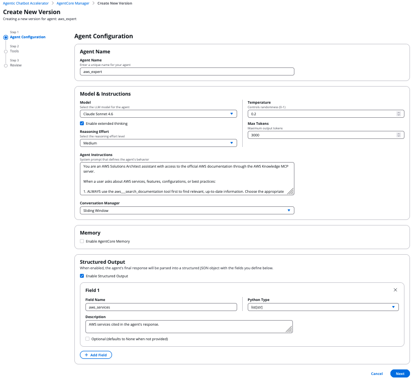
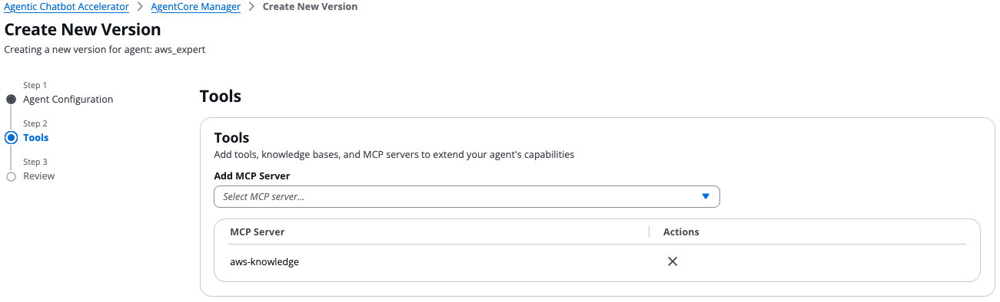

# Single Agent

This guide explains how to create and test a single agent using the Agentic Chatbot Accelerator. A single agent is the simplest architecture — one agent with direct access to tools, knowledge bases, and MCP servers that handles all user requests on its own.

## Overview

A single agent configuration consists of:

- **Model & Inference Parameters**: The LLM model, temperature, max tokens, stop sequences, and optional reasoning budget for extended thinking
- **Instructions**: A system prompt defining the agent's role and behavior
- **Tools**: Function-based or object-based tools registered in the tool registry
- **MCP Servers**: External MCP servers providing additional tool capabilities (e.g. AWS Knowledge, custom APIs)
- **Conversation Manager**: How conversation history is managed (Sliding Window is recommended)
- **Memory** (optional): AgentCore Memory for persisting conversation context across sessions
- **Structured Output** (optional): A dynamic Pydantic model that validates and structures the agent's final response into typed fields

Unlike swarm, graph, or agents-as-tools architectures, a single agent handles everything directly — there is no delegation, handoff, or orchestration. This makes it ideal for focused tasks where one agent with the right tools is sufficient.

The single agent is built on [Strands Agents](https://strandsagents.com/) and runs as a containerized runtime on Amazon Bedrock AgentCore.

## Prerequisites

Before creating a single agent, you need:

1. **The accelerator deployed** (CDK or Terraform stack)
2. **At least one model** available in Amazon Bedrock in your region (e.g. Claude Sonnet 4.6, Claude Haiku 4.5, Nova 2 Lite)
3. **Tools or MCP servers** registered (optional — agents can work without tools)

## Step-by-Step: Creating a Single Agent

### 1. Open the Agent Factory

Go to **Agent Factory** → **Create Agent** and select **Single Agent** as the architecture type.

### 2. Configure model and instructions

In the **Agent Configuration** step:

1. **Agent Name**: Enter a unique name for your agent (e.g. `aws_expert`)
2. **Model**: Select the LLM model (e.g. Claude Sonnet 4.6, Claude Haiku 4.5)
3. **Temperature**: Controls randomness (0–1). Lower values (0.1–0.3) for factual tasks, higher (0.7–0.9) for creative tasks
4. **Max Tokens**: Maximum output tokens (e.g. 3000)
5. **Extended Thinking** (optional): Enable for models that support reasoning. When enabled, select a **Reasoning Effort** level (Low, Medium, High)
6. **Agent Instructions**: Write a system prompt that defines the agent's role, behavior, and how it should use its tools

### 3. Configure conversation manager

Select the **Conversation Manager** to control how conversation history is managed:

- **Sliding Window** (recommended): Maintains a rolling window of recent messages
- **Null**: No conversation history management

### 4. Enable memory (optional)

Check **Enable AgentCore Memory** to persist conversation context across sessions. When enabled, an AgentCore Memory resource is created and attached to your agent runtime, allowing it to maintain context even when sessions are terminated and resumed.

### 5. Configure structured output (optional)

Check **Enable Structured Output** to have the agent return structured JSON responses validated against typed fields:

1. Click **+ Add Field** to define each output field
2. For each field, specify:
   - **Field Name**: A valid Python identifier (e.g. `aws_services`, `summary`)
   - **Python Type**: The field type (`str`, `int`, `float`, `bool`, `list[str]`, `list[int]`, `list[float]`, `dict`)
   - **Description**: A human-readable description of what this field contains
   - **Optional**: Check if the field can be `None`

The agent's final response will be automatically parsed into a Pydantic model with these fields.



### 6. Add tools (optional)

In the **Tools** step, extend your agent's capabilities:

- **MCP Servers**: Select from registered MCP servers (e.g. `aws-knowledge` for AWS documentation search)
- **Custom Tools**: Select from registered function-based or object-based tools
- **Knowledge Bases**: Attach Amazon Bedrock Knowledge Bases for RAG if enabled in the deployment configuration

You can add multiple tools — the agent will decide which one(s) to use based on the user's request and the tool descriptions.



### 7. Review and create

The review step shows a **JSON preview** of the complete agent configuration. Click **Create Runtime** to submit. The agent goes through the creation pipeline (Step Function → AgentCore Runtime) and will reach "Ready" status when deployment is complete.

### 8. Test the agent

Once the agent reaches "Ready" status:

1. Go to the **Chat** interface
2. Select your agent's endpoint
3. Send a message — the agent will process the request, optionally invoke tools, and return a response

## Example: AWS Solutions Architect Assistant

A single agent that uses the AWS Knowledge MCP server to answer questions about AWS services with up-to-date documentation.

### Setup

1. **Register the MCP server** — register the [AWS Knowledge MCP server](https://github.com/awslabs/mcp/tree/main/src/aws-knowledge-mcp-server) with:
   - **Name**: `aws-knowledge`
   - **URL**: `https://knowledge-mcp.global.api.aws`
   - **Auth Type**: NONE
   - **Description**: AWS documentation search, regional availability, and content recommendations

2. **Create the agent**:
   - **Agent Factory** → **Create Agent** → **Single Agent**
   - **Name**: `aws_expert`
   - **Model**: Claude Sonnet 4.6 (or Nova 2 Lite for faster responses)
   - **Temperature**: 0.2
   - **Max Tokens**: 3000
   - **Extended Thinking**: Enabled, Reasoning Effort: Medium

3. **Instructions**:

```
You are an AWS Solutions Architect assistant with access to the official AWS documentation through the AWS Knowledge MCP server.

When a user asks about AWS services, features, configurations, or best practices:

1. ALWAYS use the aws___search_documentation tool first to find relevant, up-to-date information. Choose the appropriate topic(s):
   - "general" for architecture, best practices, tutorials
   - "reference_documentation" for API/SDK/CLI details
   - "troubleshooting" for errors and debugging
   - "current_awareness" for new features and announcements
   - "cdk_docs" or "cdk_constructs" for CDK questions
   - "cloudformation" for CloudFormation templates

2. If the search results reference a specific documentation page, use aws___read_documentation to fetch the full content for detailed answers.

3. Use aws___recommend to suggest related documentation the user might find helpful.

4. For region-specific questions, use aws___get_regional_availability to check service availability.

Your responses should:
- Cite the documentation URL for every claim
- Include code examples when available from the docs
- Be concise but thorough
- Clearly distinguish between what the docs say vs. your general knowledge
- If the docs don't cover something, say so explicitly

Never make up AWS service limits, pricing, or feature availability — always verify via the tools.
```

4. **Tools**: Select `aws-knowledge` MCP server
5. **Conversation Manager**: Sliding Window

### Test it

Open the chat interface, select the `aws_expert` endpoint, and try:

```
User: What are the best practices for S3 bucket security?

→ Agent searches AWS documentation for S3 security best practices
→ Reads relevant documentation pages for detailed guidance
→ Returns a comprehensive answer with citations and code examples
```

Other test prompts:
- *"How do I set up a Lambda function with a DynamoDB trigger using CDK in TypeScript?"*
- *"Is Amazon Bedrock available in eu-west-1?"*
- *"What's new with Amazon ECS in 2025?"*
- *"I'm getting an AccessDenied error on S3 GetObject, how do I fix it?"*

## Features

### Extended Thinking

When enabled, the agent uses the model's reasoning capabilities to think through complex problems before responding. Configure the **Reasoning Effort** level:

| Level | Use Case |
|---|---|
| **Low** | Simple, factual questions |
| **Medium** | Multi-step reasoning, analysis |
| **High** | Complex problem-solving, architecture design |

The agent's reasoning process is captured and can be displayed alongside the final response. Extended thinking requires a model that supports it (e.g. Claude Sonnet 4.6).

### Structured Output

Structured output turns free-form agent responses into validated, typed JSON objects. This is useful when downstream systems need to consume the agent's output programmatically.

**How it works:**
1. You define field specifications in the agent configuration (name, type, description)
2. At runtime, a Pydantic model is dynamically created from these specs (via `structured_output.py`)
3. The Strands agent parses its final LLM response into the model
4. The validated structured output is included in the response alongside the text

**Supported types:** `str`, `int`, `float`, `bool`, `list[str]`, `list[int]`, `list[float]`, `dict`

**Example:** A field spec like `{ name: "aws_services", pythonType: "list[str]", description: "AWS services cited in the response" }` would extract a list of service names from the agent's answer.

### AgentCore Memory

When enabled, AgentCore Memory provides persistent conversation context:

- Conversation state is stored both locally (in-memory) and remotely (AgentCore Memory)
- When a session is resumed, the session manager rehydrates state from AgentCore Memory
- This allows the agent to remember previous conversations even after the container restarts

## Viewing Agent Configuration

To inspect an existing single agent's configuration:

1. Go to **Agent Factory**
2. Find the agent in the table — the **Architecture** column shows "SINGLE"
3. Click on a version to open the **View Version** modal
4. The modal displays: model configuration, agent instructions, tools, MCP servers, conversation manager, and structured output settings

## Creating a New Version

To update an agent's configuration:

1. Select the agent in the **Agent Factory** table
2. Click **New version**
3. The wizard opens with the existing configuration pre-populated
4. Modify model, instructions, tools, or other settings as needed
5. Click **Create Runtime** to deploy the new version

## How It Works Under the Hood

1. The UI sends a `createAgentCoreRuntime` mutation with `architectureType: SINGLE` and the agent config as `configValue`
2. The Agent Factory Resolver validates the config against `AgentConfiguration` (Pydantic) and starts a Step Function
3. The Step Function invokes the Create Runtime Version Lambda, which selects the single agent Docker container (`docker/`)
4. At runtime, the container's `data_source.py` loads the agent configuration from DynamoDB
5. `registry.py` loads available tools and MCP servers from DynamoDB at module initialization
6. `factory.py` creates a Strands `Agent` with the configured model, instructions, tools, conversation manager, and optional session manager
7. `callbacks.py` hooks into tool execution events — logging tool invocations, capturing tool arguments/results for trajectory evaluation, and tracking Knowledge Base references
8. `app.py` handles incoming requests: initializes the agent once per session, streams tokens via SSE, captures reasoning content, and returns the final response with optional structured output and trajectory data

### Key source files

| File | Role |
|---|---|
| `docker/app.py` | Entry point — handles requests, streams responses, manages sessions |
| `docker/src/data_source.py` | Loads agent configuration from DynamoDB |
| `docker/src/factory.py` | Creates the Strands Agent with model, tools, and callbacks |
| `docker/src/types.py` | Pydantic models for `AgentConfiguration` and `StructuredOutputFieldSpec` |
| `docker/src/registry.py` | Loads tool and MCP server registries from DynamoDB |
| `docker/src/callbacks.py` | Tool execution logging and trajectory capture for evaluations |
| `docker/src/structured_output.py` | Dynamically builds Pydantic models from field specifications |

## Best Practices

### Writing effective instructions

- **Be specific** about the agent's role and domain expertise
- **Reference tools by name** and explain when each should be used
- **Include output formatting** guidelines (e.g. "Use markdown headings", "Always cite sources")
- **Set boundaries** — tell the agent what it should *not* do or when to say "I don't know"

### Tool selection

- Start with **MCP servers** for external capabilities — they're the recommended approach
- Use **Knowledge Bases** for RAG over your own documents
- Use **custom tools** for quick prototyping or tightly-coupled logic
- Don't overload the agent with too many tools — the model performs better with a focused set

### When to use single agent vs. other patterns

| Pattern | Best for |
|---|---|
| **Single Agent** | Focused tasks with direct tool access — the simplest and fastest to set up |
| **Agents as Tools** | Dynamic delegation where an orchestrator decides which specialists to invoke |
| **Swarm** | Collaborative workflows where agents hand off conversations to each other |
| **Graph** | Predefined workflows with fixed execution paths and conditional routing |

## Troubleshooting

| Issue | Cause | Fix |
|---|---|---|
| Tools not appearing | Tool/MCP not registered | Check the tool registry in DynamoDB or register via the UI |
| MCP server connection fails | Wrong auth type or endpoint | Verify the MCP server configuration (SigV4 vs. NONE, correct Runtime/Gateway ID) |
| Structured output parsing fails | Field types don't match agent output | Adjust field descriptions to guide the model, or simplify field types |
| Extended thinking not working | Model doesn't support reasoning | Use a model that supports extended thinking (e.g. Claude Sonnet 4.6) |
| Session state lost | Memory not enabled | Enable AgentCore Memory in the agent configuration |
| Slow responses | High reasoning effort or many tools | Reduce reasoning effort, limit tool count, or use a faster model |
| "Configuration not found" error | DynamoDB item missing | Verify the agent was created successfully and check CloudWatch logs |
