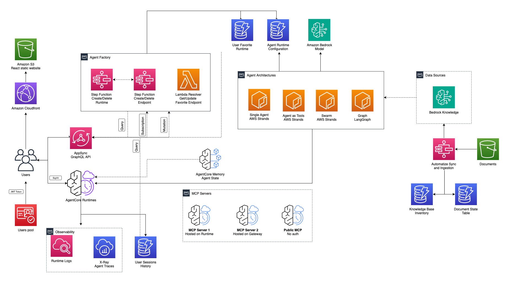

# AWS Architecture

- **Frontend & User Access**
  - React Static Website: Hosted on Amazon S3 and distributed globally via Amazon CloudFront for low-latency access
  - User Authentication: Managed through Amazon Cognito for secure identity and access management
  - GraphQL API: AWS AppSync serves as the primary interface for real-time backend communication
- **AI Chatbot Service** - The chatbot service orchestrates bidirectional message flow between users and AI agents:
  - User Message Flow:
    - Users send messages through an AppSync mutation and subscribe to responses via GraphQL subscriptions
    - Inbound messages are published to an Amazon SNS topic for asynchronous processing
  - Inbound Message Handler (AWS Lambda):
    - Subscribes to the SNS topic for incoming messages
    - Invokes the conversational agent hosted on Amazon Bedrock AgentCore runtime
    - Persists conversation history to Amazon DynamoDB for UI rendering and session management
    - Publishes streaming tokens and final responses to an outbound SNS topic
  - Outbound Message Handler (Lambda):
    - Subscribes to the outbound SNS topic
    - Delivers responses back to clients in real-time through AppSync GraphQL subscriptions
- **Agent Factory** - The Agent Factory provides dynamic agent lifecycle management and configuration:
  - AppSync Resolvers: Handle CRUD operations for Bedrock AgentCore runtime instances
  - Agent Configuration:
    - Amazon ECR container images package AWS Strands Agents with flexible configuration options
    - Runtime configurations are dynamically applied based on settings stored in DynamoDB
    - Supports agent runtime creation/deletion, endpoint management, and favorite endpoint persistence
    - MCP Servers: Users can attach existing Model Context Protocol (MCP) servers to their agents, enabling integration with external tools and resources
  - Agent Runtime Dependencies:
    - Foundation Models: Serverless large language models hosted on Amazon Bedrock
    - Data Sources: Amazon Bedrock Knowledge Bases enable semantic/hybrid search and retrieval-augmented generation (RAG)
  - Storage: Amazon DynamoDB for agent configuration management
- **Agent Execution Environment** - The agent execution layer handles the core AI processing and integration:
  - Runtime Deployment: Agents are deployed to Amazon Bedrock AgentCore Runtime as Docker containers registered in Amazon ECR
  - Knowledge Integration (**if enabled in CDK configuration**):
    - Agents connect to Amazon Bedrock Knowledge Bases to implement retrieval tools for RAG
    - Knowledge bases are automatically populated via an AWS Step Functions workflow triggered when documents are uploaded to a designated Amazon S3 bucket
  - Observability & Monitoring (Amazon AgentCore Observability):
    - Agent runtime logs are stored in Amazon CloudWatch Logs for debugging and analysis
    - Distributed traces are captured in AWS X-Ray for performance monitoring and troubleshooting
  - State Management: Agents persist conversational state using Amazon Bedrock AgentCore Memory (when enabled) for context-aware interactions
