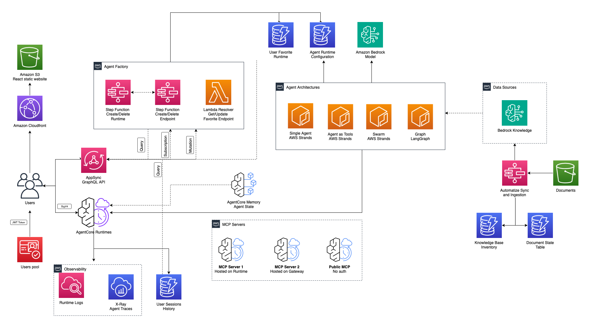

# AWS Architecture



## Frontend

| Resource | Role |
|----------|------|
| Amazon CloudFront | CDN distribution for global low-latency access |
| Amazon S3 (Website Bucket) | Static React application hosting |
| Amazon S3 (Website Logs) | Access logs for the website bucket |
| Amazon S3 (CF Distribution Logs) | CloudFront access logs |

## Authentication

| Resource | Role |
|----------|------|
| Amazon Cognito User Pool | User identity and authentication |
| Amazon Cognito Identity Pool | Temporary AWS credentials for authenticated users (used to sign presigned WebSocket URLs for direct AgentCore access) |

## API Layer

| Resource | Role |
|----------|------|
| AWS AppSync (GraphQL API) | Primary API for CRUD operations (sessions, agent config, evaluations) and runtime/evaluation status notifications |
| λ HTTP API Resolver | Handles REST-like queries (session history, feedback, runtime management) |
| Step Function — Create Runtime | Orchestrates agent runtime creation (validate config → create AgentCore runtime → tag endpoint) |
| Step Function — Delete Runtime | Orchestrates agent runtime deletion (delete endpoint → delete runtime → cleanup) |
| DynamoDB — Chatbot Sessions | Conversation history storage |
| DynamoDB — Evaluators | Evaluation configurations and results |
| DynamoDB — Template Schemas | Agent configuration schemas |

## GenAI Interface

| Resource | Role |
|----------|------|
| λ Notify Runtime Update | Notifies the frontend via AppSync when runtime status changes (creation complete, deletion complete) |

> **Note:** Tool steps ("Using X…", arguments, success/error status) are emitted by the
> AgentCore container **directly over the browser WebSocket** alongside the chat stream
> (see [Real-Time Communication](#real-time-communication-direct-websocket)). AppSync is
> used only to notify the frontend of runtime status changes, not for the live chat or
> tool-step stream.

## AgentCore Infrastructure

Each agentic pattern ships as its own container image. For how to build and use each, see the pattern guides: [Single Agent](./agentic-patterns/single-agent.md), [Agents as Tools](./agentic-patterns/agents-as-tools.md), [Swarm](./agentic-patterns/swarm-agents.md), and [Graph](./agentic-patterns/graph-agents.md).

| Resource | Role |
|----------|------|
| Amazon Bedrock AgentCore Runtime | Managed runtime hosting Docker containers as agent endpoints |
| FastAPI Application (in container) | WebSocket server exposing `/ws` (text + voice via `voice_init`), plus `/invocations` for agent-to-agent calls |
| ECR — Single Agent | Container image for single-agent pattern (Strands Agents) |
| ECR — Agents-as-Tools | Container image for orchestrator + sub-agents pattern |
| ECR — Swarm Agent | Container image for swarm multi-agent pattern |
| ECR — Graph Agent | Container image for directed-graph agent pattern |
| IAM Execution Role | Runtime permissions for Bedrock, DynamoDB, SSM |
| DynamoDB — Runtime Config | Agent configuration (model, instructions, tools, parameters) |
| DynamoDB — Tool Registry | Custom tool definitions |
| DynamoDB — MCP Server Registry | Registered MCP servers (endpoints, auth) |
| DynamoDB — State Class Registry | Swarm/graph state class configurations |
| DynamoDB — Structured Outputs | Structured output field specifications |
| DynamoDB — Agent Summary | Agent metadata and endpoint status |
| DynamoDB — Deterministic Nodes | Graph agent deterministic node configurations |
| SSM Parameters | Runtime environment configuration (account ID, region, table names) |

## Real-Time Communication (Direct WebSocket)

The browser connects **directly** to the AgentCore container — no API Gateway or proxy Lambda in the data path.

```
Browser → SigV4 presigned URL → wss://bedrock-agentcore.<region>.amazonaws.com/runtimes/<ARN>/ws → FastAPI /ws endpoint
```

| Mode | Protocol | Description |
|------|----------|-------------|
| **Text** | WebSocket `/ws` | Client sends `text_input`, receives `text_token` + `final_response` |
| **Voice** | WebSocket `/ws` with `voice_init` | Client sends `voice_init` to switch to BidiAgent mode; bidirectional audio streaming via Nova Sonic |
| **Tool steps** | WebSocket `/ws` | Container emits `tool_action` / `tool_complete` events as tools run, so the UI shows each step (label, arguments, success/error) in real time |
| **Agent-to-Agent** | HTTP POST `/invocations` | SSE stream for orchestrator → sub-agent delegation |

## Amazon Bedrock — Foundation Models

The selectable model set is a **region-scoped platform fact** hard-coded in [`iac-cdk/lib/shared/supported-models.ts`](../../iac-cdk/lib/shared/supported-models.ts), keyed by deploy region — not a `config.yaml` knob. It spans Bedrock **Converse** models (Claude, Nova) and the **Bedrock Mantle** tail (OSS models, the newest OpenAI/Anthropic); `create_model` routes each id to its native protocol automatically. To change the offered set, edit `SUPPORTED_MODELS` and redeploy. See [Bedrock Mantle Models](./mantle-models.md) for the full catalog and routing, and [ADR-0004](../adr/0004-region-scoped-model-catalog.md) for why it moved out of configuration.

A representative slice of what a US region offers:

| Model | Use Case |
|-------|----------|
| Claude Sonnet 5 | Balanced performance/cost, extended thinking |
| Claude Opus 4.8 | Highest-capability reasoning |
| GPT-5.6 / GPT OSS | OpenAI proprietary (Responses API) and open-weights (Chat Completions) via Mantle |
| Amazon Nova 2 Lite | Fast text inference |
| Amazon Nova 2 Sonic | Voice-to-voice bidirectional streaming (BidiAgent) — required for voice |

## Data Processing *(optional)*

Enabled when `knowledgeBaseParameters` and `dataProcessingParameters` are configured.

| Resource | Role |
|----------|------|
| Amazon S3 (Document Bucket) | Document upload storage |
| Step Function — Document Processing | Orchestrates chunking, embedding, and ingestion into Knowledge Base |
| Amazon Bedrock Knowledge Base | Semantic/hybrid search for RAG. Backend selectable via `vectorStoreType`: Amazon OpenSearch Serverless (default, supports hybrid search) or Amazon S3 Vectors (cheaper, semantic-only) — see [Vector Store Backend](./kb-management.md#vector-store-backend) |
| Lambda functions | Document processing steps (chunking, metadata extraction) |

## Observability & Monitoring

| Resource | Role |
|----------|------|
| AWS X-Ray (Transaction Search) | Distributed tracing for agent invocations |
| CloudWatch Dashboard | Operational metrics visualization |
| CloudWatch Alarms (All Lambdas) | Error rate and duration alerts |
| SNS — Lambda Alarms | Alarm notification delivery |
| CloudTrail (DynamoDB Events) | Audit trail for data access |
| Amazon S3 (CloudTrail Logs) | CloudTrail log storage |

## Cleanup

| Resource | Role |
|----------|------|
| λ Cleanup Handler | Removes expired sessions, orphaned resources on stack deletion |
